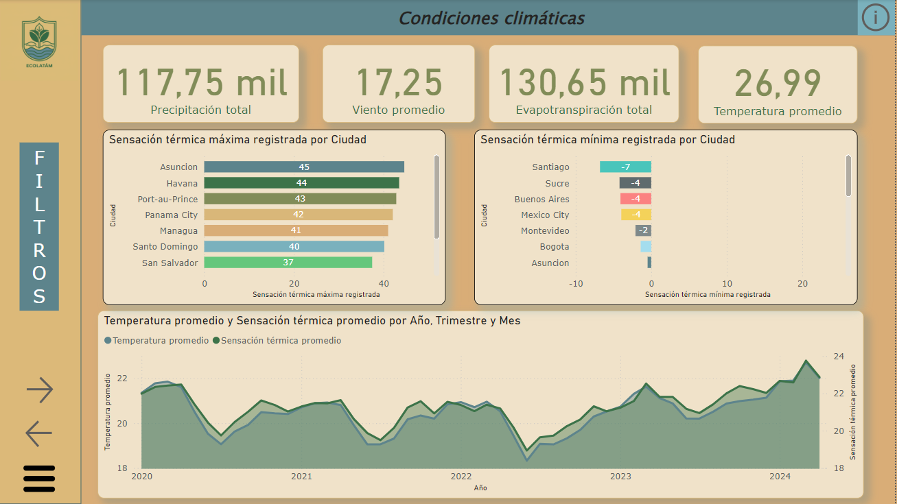
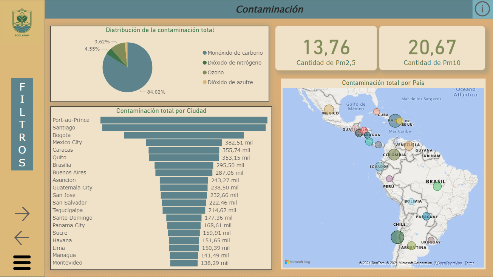
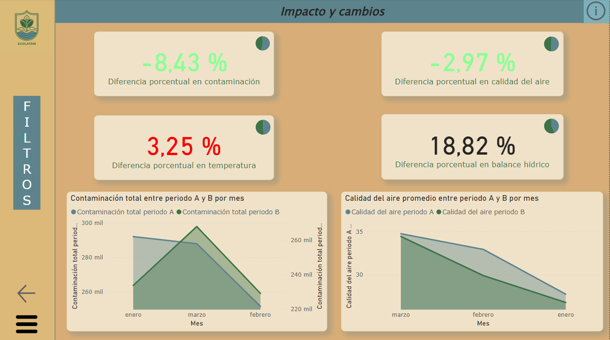

# Contaminación del medio ambiente, calidad del aire y cambio climático en Latinoamérica

## Descripción del tema

La contaminación ambiental es la presencia de componentes nocivos, bien sean de naturaleza biológica, química o de otra clase, en el medioambiente, de modo que supongan un perjuicio para los seres vivos que habitan un espacio, incluyendo, por supuesto, a los seres humanos. Generalmente la contaminación ambiental tiene su origen en alguna actividad humana.
Las partículas en suspensión y gases producidos por el tráfico rodado, la industria y las calefacciones son los principales causantes de la contaminación atmosférica. El incremento de la emisión de CO2 provoca el calentamiento global que deriva en el cambio climático y por consiguiente provoca los efectos climáticos adversos como olas de calor, sequía, inundaciones, etc. La principal fuente de contaminación atmosférica son los gases ozono troposférico (O3), óxidos de azufre (SO2 y SO₃), óxidos de nitrógeno (NO y NO2), benzopireno (BaP) y las partículas en suspensión (PM). Estos gases se derivan principalmente de las emisiones provocadas por la quema de combustibles fósiles (incluidas las emisiones generadas por el transporte), los procesos industriales, la quema de bosques, el empleo de aerosoles y la radiación.

## Objetivo

En el presente proyecto se pretende analizar la evolución de la calidad del aire y la emisión de gases contaminantes, así como el impacto de esta contaminación en la temperatura en los países de Latinoamérica en los últimos años. Se hará un análisis semestral como anual de la temática.

## Hipótesis

La emisión de gases sigue en aumento, contaminando la atmosfera, lo que contribuye al calentamiento global y, por ende, al aumento de la temperatura.

## Nivel de aplicación del análisis

Los tableros serán para el uso a nivel estratégico, siendo los dirigentes de cada país los destinatarios de los mismos para su análisis.

## Acerca del dataset

Clima y calidad del aire en Latinoamérica
Este dataset contiene 2 archivos CSV generados a partir de la API Open-Meteo y contiene información sobre varios países de Latinoamérica. Los datasets incluyen nombre del país, capital, clima y calidad del aire. Los mismos se pueden encontrar en los siguientes links:

    https://www.kaggle.com/datasets/anycaroliny/latin-america-weather-and-air-quality-data?resource=download&select=LA_daily_climate.csv
-

    https://github.com/anycarolinys/kaggle_weather_dataset

## Tratamiento de los datos

Para el proyecto, se decidió crear una base de datos en SQL Server donde la información que contenida en los datasets se normalizó para luego alimentar el dashboard de Power Bi para mostrar la información. Como se realizó la creación de la base de datos está especificado en el archivo SQLQuerys.

## Dashboard

En este apartado se mencionará una breve descripción del dashboard desarrollado con los datos disponibles con sus respectivas solapas. En cada hoja se incluyó una boton de información con un glosario. Para mayor información se recomienda leer la documentación respaldatoria adjunta en el repositorio.

### Condiciones climáticas

En esta primera solapa se muestra toda la información relativa al clima, como las precipitaciones y evapotranspiración totales, viento y temperatura media, temperaturas máximas y mínimas registradas por ciudad y la evolución de la temperatura a lo largo del tiempo. Se puede filtrar por tiempo y por país y ciudad (Si bien hay una sola ciudad por país, se deja listo en caso de que se agregue más información a la base de datos en el futuro)

### Contaminación

En esta solapa, se muestra todo lo relativo a los agentes de contaminación detectados y las partículas que afectan a la calidad del aire medidas en el día a día, con un mapa que muestra a simple vista que país emitió más por el tamaño de la burbuja. Los pm son los indicadores de la calidad del aire y se muestra el promedio diario registrado. Con respecto a los agentes contaminantes, se consideró sumarlos para mostrar un total de contaminación que luego se desglosan en el grafico de torta y tooltip correspondiente. Se muestra una sumatoria de las mismas en función del tiempo y se puede filtrar por año, trimestre, mes, país y ciudad como la solapa anterior.

### Impacto y cambios

En esta solapa vemos el cambio que hubo entre dos periodos especificados, si este cambio fue positivo o no, y la comparación de ese periodo con el mismo de otro año especificado. La diferencia se muestra en porcentaje, expresando en rojo un indicador de riesgo y en verde como que esa métrica mostró una mejora Esta solapa posee dos filtros de tiempo para configurar cada periodo que se compara, siendo el A el más antiguo y el B el más reciente, para que el usuario compare los periodos que requiera. También posee un filtro general por país para hacer foco en una zona en particular.

